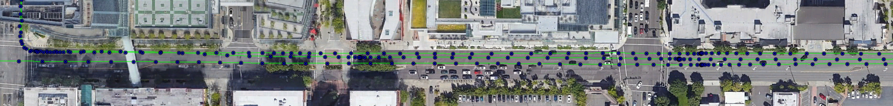

# Precision GNSS
Dataset of GNSS location trajectories from both low-cost high-precision GNSS system and ground-truth reference GNSS system.




If you use this dataset, please cite

```
@inproceedings{precision-gnss,
  author    = {ABM Musa and Chris Baker and Emre Eftelioglu and Amber Roy Chowdhury},
  title     = {High-accuracy GNSS Localization with Low-cost},
  booktitle = {Proceedings of the 30th International Conference on Advances in Geographic Information Systems},
  year      = {2022},
}
```

## Abstract
Sub-meter accurate vehicle localization is often the ultimate goal in the automotive industry as well as fleet management today and the Global Navigation Satellite System (GNSS) is one of the most practical ways to achieve this goal. In addition to precise navigation and real-time accurate vehicle location tracking, the high-accuracy location data enables many geospatial and mapping applications. Traditionally, high-accuracy GNSS localization solutions were highly expensive. However, we can now achieve high accuracy localization by combining GNSS and Inertial Measurement Unit (IMU) along with Real-Time Kinematic (RTK) correction at a high availability with low cost. In this paper, we present the evaluation and experimental results of such a solution that we are deploying in a large vehicle fleet. Our experiments show that sub-meter localization accuracy can be achieved in most scenarios. Additionally, we present various geospatial applications of the high-accuracy GPS trajectories, some of which were previously impossible with the data collected from low-accuracy consumer-grade sensors. Finally, we share a dataset with multiple GPS trajectories containing GNSS data from both our low-cost and ground-truth GNSS systems. We believe this dataset will enable further research on various applications of high-accuracy location data as well as GNSS characteristics in different areas. 

## Dataset description
The GNSS location trajectories are available at `trajectories.zip`, which contains four directories with four driving trajectories. Inside each directory, `precision_gnss.csv` contains the data from our low-cost GNSS system and `reference_gnss.csv` contains the data from our ground-truth reference GNSS system. All four trajectories are approximately for the same route, which contains Seattle downtown, Bellevue downtown, two tunnels, suburbs and highways in Washington, USA. This route is approximately 42 miles and takes approximately 2 hours to drive. The trajectory data is at 10Hz and has over 300k location points combining all four trajectories. 


## Security

See [CONTRIBUTING](CONTRIBUTING.md#security-issue-notifications) for more information.

## License

This library is licensed under the CC-BY-4.0 License.

